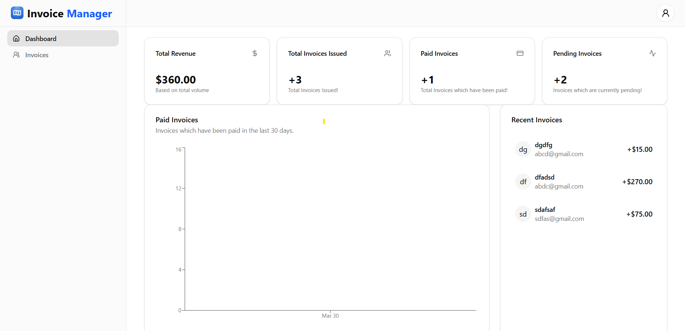

# InvoiceManager

A modern, full-stack invoice management application built with Next.js, featuring email capabilities, PDF generation, and a beautiful dashboard.

## ✨ Features

### Core Functionality
- 💪 **Complete Invoice Management**: Create, edit, and mark invoices as paid
- 👀 **Client Communication**: Send invoices directly to clients
- 🏄‍♂️ **Automated Reminders**: Send reminder emails for outstanding invoices
- 📃 **Real PDF Generation**: Generate professional PDF invoices
- 🎨 **Beautiful Dashboard**: Interactive dashboard with animated charts

### Tech Stack
- 🌐 **Next.js App Router**: Modern routing and server components
- 💽 **Neon Postgres Database**: Serverless Postgres for reliable data storage
- 💨 **Prisma ORM**: Type-safe database queries and migrations
- 🎨 **Styling**: Tailwind CSS with Shadcn UI components
- ✅ **Validation**: Server-side validation using Zod and Conform

### Authentication & Security
- 🔒 **Custom Auth**: Built with Auth.js for secure authentication
- 🔑 **Magic Link Auth**: Passwordless authentication via Mailtrap

### Email & Communication
- 📧 **Mailtrap Email API**: Reliable email delivery
- 🚀 **Email Templates**: Beautiful, responsive email templates

### Deployment
- 😶‍🌫️ **Vercel Deployment**: One-click deployment to Vercel

## 🚀 Getting Started

### Prerequisites
- Node.js (v16+)
- npm or yarn
- Mailtrap account
- Neon Postgres database

### Installation

1. Clone the repository
```bash
git clone https://github.com/yourusername/invoiceflow.git
cd invoiceflow
```

2. Install dependencies
```bash
npm install
# or
yarn install
```

3. Set up environment variables
```
# Create a .env file with the following variables
DATABASE_URL=your_neon_postgres_url
MAILTRAP_API_KEY=your_mailtrap_api_key
NEXTAUTH_SECRET=your_nextauth_secret
NEXTAUTH_URL=http://localhost:3000
```

4. Run database migrations
```bash
npx prisma migrate dev
```

5. Start the development server
```bash
npm run dev
# or
yarn dev
```

6. Open [http://localhost:3000](http://localhost:3000) in your browser

## 📸 Screenshots



## 🤝 Contributing

Contributions are welcome! Please feel free to submit a Pull Request.

## 📄 License

This project is licensed under the MIT License - see the LICENSE file for details.

## 🙏 Acknowledgements

- Next.js team for the incredible framework
- Shadcn for the beautiful UI components
- Mailtrap for reliable email testing
- Neon for the serverless Postgres database